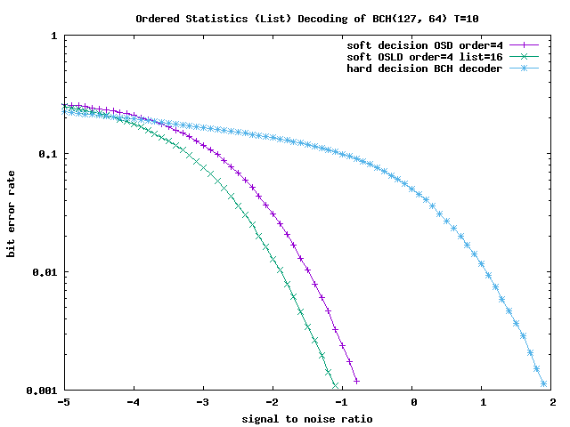

This is a work in progress and a long overdue attempt to bring all our not-DSP-related code together and make it reusable for our future projects.

Before using any of this you should enter the tests directory and execute "make".
This will check if your compiler is able to create binaries that are able to produce correct results when executed.

What we have included so far:

### [crc.hh](crc.hh)

A [Cyclic redundancy check](https://en.wikipedia.org/wiki/Cyclic_redundancy_check) helps ensuring data integrity.

For example, if we need to integrate CRC32 checking for a few bytes, like in the following:
```
# echo -n 'Hello World!' | rhash -C -
(stdin) 1C291CA3
```
We can add it to our project as simple as that:
```
CODE::CRC<uint32_t> crc(0xEDB88320, 0xFFFFFFFF);
for (uint8_t c: std::string("Hello World!")) crc(c);
assert(~crc() == 0x1C291CA3);
```

### [xorshift.hh](xorshift.hh)

Sometimes we need a sequence of ["random enough"](https://en.wikipedia.org/wiki/Diehard_tests) numbers but don't want to store them in an array to get a repeatable sequence.
Here a [Pseudorandom number generator](https://en.wikipedia.org/wiki/Pseudorandom_number_generator) can help by prodiving a deterministic and thus repeatable sequence of numbers.
[George Marsaglia](https://en.wikipedia.org/wiki/George_Marsaglia) discovered a class of simple and fast pseudorandom number generators, which he called [Xorshift](https://en.wikipedia.org/wiki/Xorshift).

### [mls.hh](mls.hh)

[Maximum length sequences](https://en.wikipedia.org/wiki/Maximum_length_sequence) have useful [correlation properties](https://en.wikipedia.org/wiki/Maximum_length_sequence#Correlation_property).

### [bitstream.hh](bitstream.hh)

When dealing with unaligned and arbitrary-bit-sized elements in a data stream, the bitwise stream container might help avoiding some headaches.

### [bitman.hh](bitman.hh)

Simple bit manipulation on byte arrays.

### [galois_field.hh](galois_field.hh)

We have to thank [Évariste Galois](https://en.wikipedia.org/wiki/%C3%89variste_Galois) for his contribution of the [Finite field](https://en.wikipedia.org/wiki/Finite_field) to mathematics, which laid the cornerstone for a variety of applications that we take for granted today.
One of them is [Reed–Solomon error correction](https://en.wikipedia.org/wiki/Reed%E2%80%93Solomon_error_correction):

### [reed_solomon_error_correction.hh](reed_solomon_error_correction.hh)

Implemented are the following Encoders and Decoders:
* [reed_solomon_encoder.hh](reed_solomon_encoder.hh)
* [reed_solomon_decoder.hh](reed_solomon_decoder.hh)
* [bose_chaudhuri_hocquenghem_encoder.hh](bose_chaudhuri_hocquenghem_encoder.hh)
* [bose_chaudhuri_hocquenghem_decoder.hh](bose_chaudhuri_hocquenghem_decoder.hh)

### [short_bch_code_encoder.hh](short_bch_code_encoder.hh)

Encoder for short [BCH codes](https://en.wikipedia.org/wiki/BCH_code)

### [short_bch_code_decoder.hh](short_bch_code_decoder.hh)

[Syndrome decoding](https://en.wikipedia.org/wiki/Decoding_methods#Syndrome_decoding) based [Soft-decision decoder](https://en.wikipedia.org/wiki/Soft-decision_decoder) for short [BCH codes](https://en.wikipedia.org/wiki/BCH_code)

### [simplex_encoder.hh](simplex_encoder.hh)

Encoder for [Simplex codes](https://en.wikipedia.org/wiki/Linear_code).

### [simplex_decoder.hh](simplex_decoder.hh)

[Soft-decision decoder](https://en.wikipedia.org/wiki/Soft-decision_decoder) for [Simplex codes](https://en.wikipedia.org/wiki/Linear_code).

### [hadamard_encoder.hh](hadamard_encoder.hh)

Encoder for [augmented Hadamard codes](https://en.wikipedia.org/wiki/Hadamard_code).

### [hadamard_decoder.hh](hadamard_decoder.hh)

[Soft-decision decoder](https://en.wikipedia.org/wiki/Soft-decision_decoder) for [augmented Hadamard codes](https://en.wikipedia.org/wiki/Hadamard_code).

### [ldpc_encoder.hh](ldpc_encoder.hh)

[Low-density parity-check](https://en.wikipedia.org/wiki/Low-density_parity-check_code) encoder

### [ldpc_decoder.hh](ldpc_decoder.hh)

[SIMD](https://en.wikipedia.org/wiki/SIMD) intra-frame accelerated [Low-density parity-check](https://en.wikipedia.org/wiki/Low-density_parity-check_code) layered decoder.

### [polar_freezer.hh](polar_freezer.hh)

Bit freezers for the construction of [polar codes](https://en.wikipedia.org/wiki/Polar_code_(coding_theory)).

* PolarFreezer: Constructs code for a given erasure probability without the need for storing nor sorting of erasure probabilities for the virtual channels.
* PolarCodeConst0: Constructs code by choosing the K best virtual channels computed from a given erasure probability.

### [polar_encoder.hh](polar_encoder.hh)

Encoders for [non-systematic and systematic](https://en.wikipedia.org/wiki/Systematic_code) [polar codes](https://en.wikipedia.org/wiki/Polar_code_(coding_theory)).

### [polar_decoder.hh](polar_decoder.hh)

Successive cancellation decoding of [polar codes](https://en.wikipedia.org/wiki/Polar_code_(coding_theory)).

### [polar_list_decoder.hh](polar_list_decoder.hh)

Successive cancellation [list decoding](https://en.wikipedia.org/wiki/List_decoding) of [polar codes](https://en.wikipedia.org/wiki/Polar_code_(coding_theory)).

List size depends on used SIMD type. Decoding performance of the fixed-point implementation is better with shorter codes, as the list size is larger but a deterioration can be observed with larger codes.

### [osd.hh](osd.hh)

Ordered statistics decoding allows the practical [soft-decision decoding](https://en.wikipedia.org/wiki/Soft-decision_decoder) of short to medium sized [linear codes](https://en.wikipedia.org/wiki/Linear_code).
Below are the BER plots of the BCH(127, 64) T=10 code, using the OSD [Soft-decision decoder](https://en.wikipedia.org/wiki/Soft-decision_decoder) and the [Reed–Solomon error correction](https://en.wikipedia.org/wiki/Reed%E2%80%93Solomon_error_correction) BCH decoder with erasures.


### [exclusive_reduce.hh](exclusive_reduce.hh)

Reduce N times while excluding ith input element

It computes the following, but having only O(N) complexity and using O(1) extra storage:

```
	output[0] = input[1];
	output[1] = input[0];
	for (int i = 2; i < N; ++i)
		output[i] = op(input[0], input[1]);
	for (int i = 0; i < N; ++i)
		for (int j = 2; j < N; ++j)
			if (i != j)
				output[i] = op(output[i], input[j]);
```

### [simd.hh](simd.hh)

Single instruction, multiple data ([SIMD](https://en.wikipedia.org/wiki/SIMD)) wrappers for:
* [ARM NEON](https://en.wikipedia.org/wiki/ARM_architecture#Advanced_SIMD_(NEON)) ([neon.hh](neon.hh))
* [Intel SSE4.1](https://en.wikipedia.org/wiki/SSE4) ([sse4_1.hh](sse4_1.hh))
* [Intel AVX2](https://en.wikipedia.org/wiki/Advanced_Vector_Extensions) ([avx2.hh](avx2.hh))

### [rotate.hh](rotate.hh)

[SIMD](https://en.wikipedia.org/wiki/SIMD) element wise horizontal rotation

It computes the following, but faster:

```
SIMD<int8_t, SIZE> rotate(SIMD<int8_t, SIZE> input, int shift, int WIDTH)
{
	SIMD<int8_t, SIZE> output;
	for (int n = 0; n < WIDTH; ++n)
		output.v[(n + shift + WIDTH) % WIDTH] = input.v[n];
	return output;
}
```

